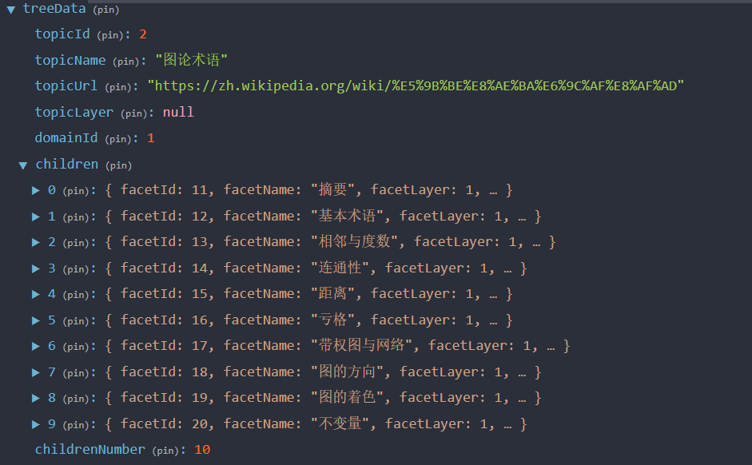
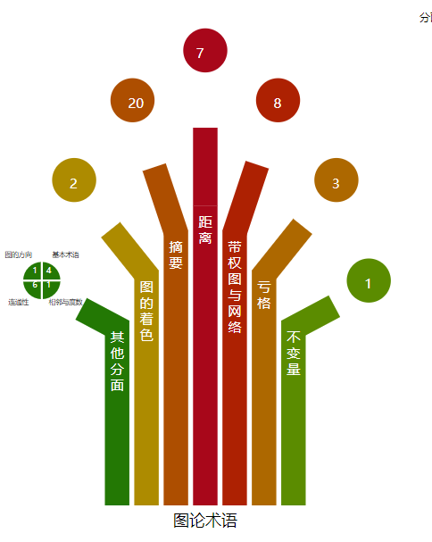

# Facet Tree Visualization

## Input and output
- Input: Hierarchical data of a topic

- Output: Data is visualized as a faceted tree

## Build
`npm run pack` 打包结果在 `/module/facetTree.js`

## Usage
1. download `facetTree.js` from `release` tab
2. import `drawTree` (refer to `index.ts`)
3. define your own click func ( like `clickFacet` in `index.ts` )
4. transfer `dom, treeData, clickFunc` to `drawTree`

## Structure
> `facetId = -1` means the facet is an aggregation of facets

### src/facet-tree-ng.ts

- 变量
1. `palettes` 调色板（二维数组）
2. `ColorNo`
3. `minFacetFontSize`
4. `maxFacetFontSize`
5. `weightSecondFacet`
6. `weightFirstLayerVideo`
7. `weightFirstLayerRichText`
8. `weightSecondLayerVideo`
9. `weightSecondLayerRichText`
10. `branchRate`
11. `branchIntervalRate`
12. `branchWidthRate`
13. `firstLayerThreshold`
14. `secondLayerThreshold`

- 函数

1. `camelSort`
2. `calcWeight` 计算分面权重
3. `calcFacetChart`
4. `buildTree`

### src/draw-tree.ts

### src/facet-force-layout.ts

### src/facet-pie-chart.ts

### src/index.ts

### src/state.ts

### src/tools/utils.ts
